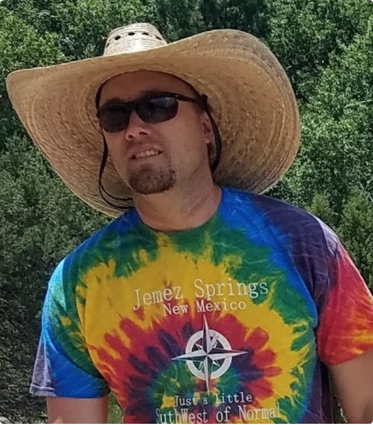
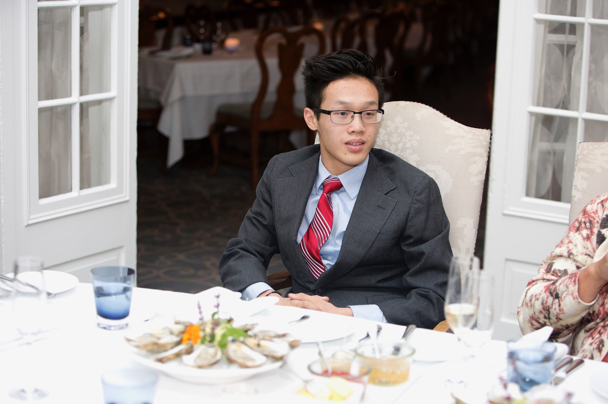

### Calliope was created by a group of scientists at the [CyVerse lab](http://www.cyverse.org/) at the University of Arizona.

Tyson Swetnam is the big boss of the project. He coaches rugby for U of A.
 

 
Daniel Lee was an intern at the CyVerse lab during the Summer of 2018. He helped with the design of Calliope View, working under Tyson to develope the first versions of the app.
 

(Images of David and Pooja)
 
David and Pooja are probably the coolest people in all of CyVerse. :sunglasses::sunglasses::sunglasses:
