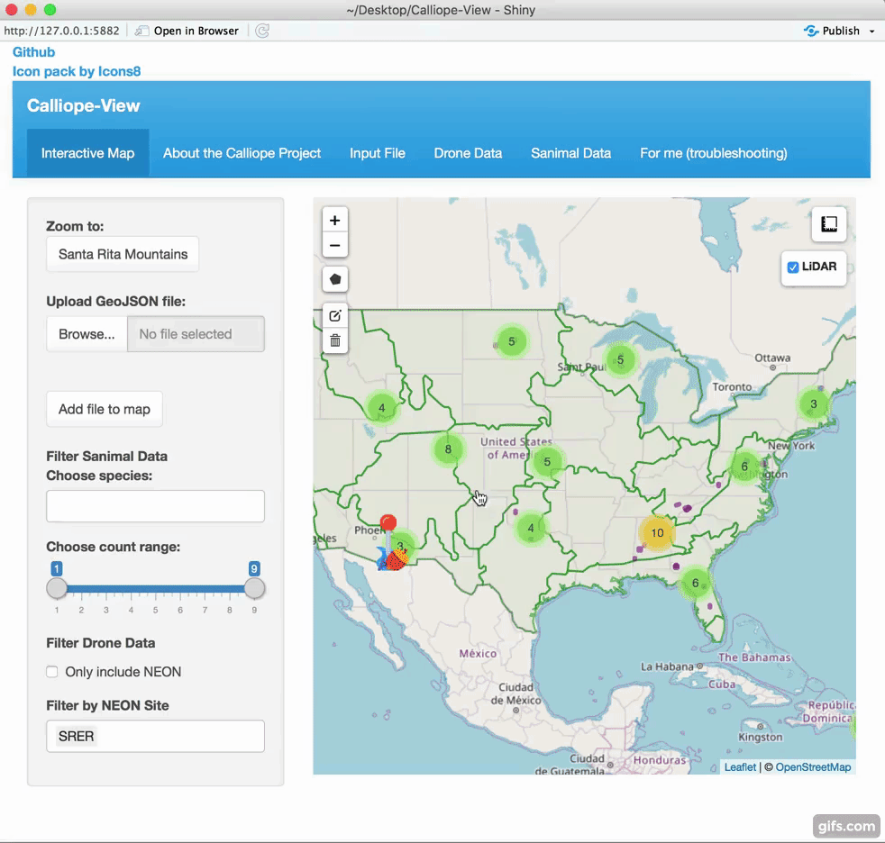
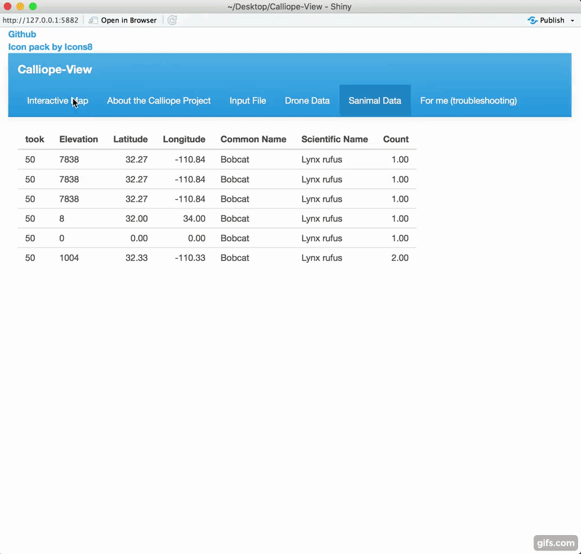
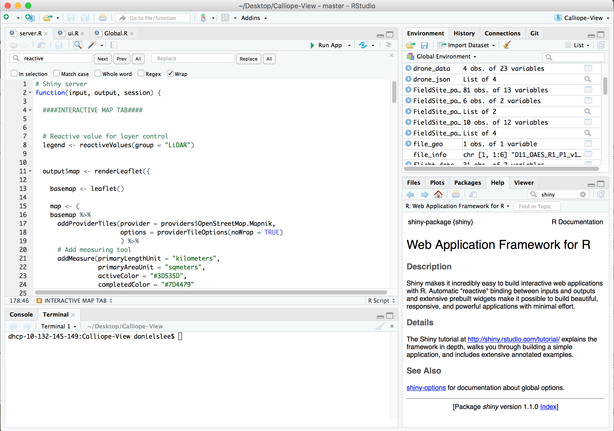

# Calliope-View
An interactive leaflet interface designed to display ecological data alongside drone imaging.
## Overview
This R Shiny app uses leaflet to display ecological data provided by [NEON](https://www.neonscience.org/) alongside drone imaging under one map. Users will then be able to compare biological statistics such as precipitation, soil temperature, humidity, and pressure with their own data to generate analyses ranging from the effects of climate change to the relationship between geographical factors and the ecosystem.

[NEON](https://www.neonscience.org/) is a "continental-scale ecological observation facility" that provides open data on our ecosystems. [NEON](https://www.neonscience.org/) is the source that this app pulls from to get ecological data.

The drone data will be pulled from a global index in [Cyverse](http://www.cyverse.org/)'s [discovery environment](https://www.cyverse.org/discovery-environment) (DE). This includes a variety of sources, such as the DE drive, S3, and private servers.
## Features
The app offers a map, which displays items such as NEON sites and domains, alongside custom data which can be filtered and displayed based on multiple variables. Here is an example of Calliope View’s display of NEON sites and their boundaries:
<br><br>

<br><br>
Here is a display of the user's ability to filter datasets via multiple varibales:
<br><br>

> The dataset being queried and shown describes animal locations because we originally used an animal dataset as placeholder for the drone data while it was being developed. The app no longer includes this data, but it is still useful in demonstrating the app, functionality.
## Use and Installation
### Git
To install, change the working directory on your shell to the desired directory, and clone from git:
``` bash
cd /Desktop
git clone https://github.com/Danielslee51/Calliope-View/
```
Then, run server.R in an R IDE (such as Rstudio). This app has to be run locally due to features that require the user's local filesystem.



### Packages
This app requires a few packages that might need to be downloaded: <br>
* [`leaflet`](https://github.com/rstudio/leaflet) and [`leaflet.extras`](https://github.com/bhaskarvk/leaflet.extras): These are responsible for the map and its features.
* [`neonUtilities`](https://github.com/NEONScience/NEON-utilities/tree/master/neonUtilities): used to pull datasets from NEON.
* [`shinyWidgets`](https://github.com/dreamRs/shinyWidgets): provides costumized and "pimp[ed]" up widgets for shiny.
* [`sf`](https://github.com/r-spatial/sf) and [`rgdal`](https://github.com/cran/rgdal): provide access to simple feature geometries.
* [`jsonlite`](https://github.com/cran/jsonlite): helps deal with JSON structures.
